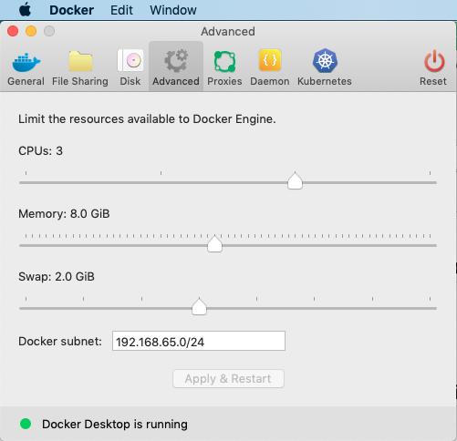

# Running GrimoireLab with docker-compose

This folder host configuration files to run GrimoireLab using 
[docker-compose](https://docs.docker.com/compose/), one of the 
easiest way to get started with GrimoireLab.

# Requirements

* A [Git](https://git-scm.com/) client
* [Docker Engine](https://docs.docker.com/install/) and [Docker Compose](https://docs.docker.com/compose/install/)
* Recommended, at least, 2CPUs, 8GB memory RAM, and 2GB SWAP (MacOS users can manage it with [Docker client for Mac](https://hub.docker.com/editions/community/docker-ce-desktop-mac))

For example, in one of my latest demos, I was using:
```console
root@qiskit-6fc71ea6:~# git --version
git version 2.17.1
root@qiskit-6fc71ea6:~# docker --version
Docker version 19.03.1, build 74b1e89
root@qiskit-6fc71ea6:~# docker-compose --version
docker-compose version 1.22.0, build f46880fe
root@qiskit-6fc71ea6:~# free
              total        used        free      shared  buff/cache   available
Mem:        8167996     3463652      128844        1440     4575500     4413328
Swap:             0           0           0
root@qiskit-6fc71ea6:~# du -hs /
du: cannot access '/proc/2234/task/2234/fd/4': No such file or directory
du: cannot access '/proc/2234/task/2234/fdinfo/4': No such file or directory
du: cannot access '/proc/2234/fd/3': No such file or directory
du: cannot access '/proc/2234/fdinfo/3': No such file or directory
26G     /
```
**Note**: `free` and `du` are Linux utilities to display amount of free and used 
memory in the system, and to estimate file space usage, respectively.

You should ensure [enough virtual memory for Elasticsearch](https://www.elastic.co/guide/en/elasticsearch/reference/current/vm-max-map-count.html) 
(one of GrimoireLab components). You can do it running the following command as `root` in Linux or as administrator user in MacOS:

## Linux
```console
sysctl -w vm.max_map_count=262144
```

## Mac
```
$ screen ~/Library/Containers/com.docker.docker/Data/vms/0/tty
(then run:) sysctl -w vm.max_map_count=262144
```

Remember also to assign proper resources to Docker through the UI. 8GB Memory and 2GB Swap should work.



# Getting started in 3 steps

1. Clone this project:
```console
git clone https://github.com/chaoss/grimoirelab
```

2. By default, this repository comes with some configuration files in [`default-grimoirelab-settings`](../default-grimoirelab-settings).
These files are the minimum set up to analyze git activity in this repository. If you want to analyze a different project with a different
set of repositories and data sources, you need to modify [`projects.json`](../default-grimoirelab-settings/projects.json) and
[`setup.cfg`](../default-grimoirelab-settings/setup.cfg) files. See [below](#more-information) more information about these files format.

3. Access to [`docker-compose`](./) folder and deploy GrimoireLab running this command:
```console
cd grimoirelab/docker-compose
docker-compose up -d
```

If everything goes well, data will be gathered and processed. To get access to
them, go to `http://localhost:5601`

To manage contributors profile information with [HatStall](https://github.com/chaoss/grimoirelab-hatstall),
go to `http://localhost:8000`. To get access:
* User: `admin`
* Pass: `admin`

**Note**: you can change user and password in the `docker-compose.yml` file.

## Secured infrastructure

Deployed infrastructure following previous steps doesn't provide any security protection
on the data generated, so **don't use this for production environments or in public access environments**.

If you want to deploy this infrastructure with minimal security, use the *secured*
environment: 
* Edit [`default-grimoirelab-settings/setup-secured.cfg`](../default-grimoirelab-settings/setup-secured.cfg) to fit your needs
* Instead of the the regular `docker-compose.yml` file, we will use `docker-compose-secured.yml`:
```console
docker-compose -f docker-compose-secured.yml up -d
```

The difference is that it uses a secured Elasticsearch image and a secured Kibiter image.

To access to the dashboard would be the same as previously, but if you need to modify something, you would be 
asked to login.
* User: `admin`
* Password: `admin`

To change them, you need to enter in `elasticsearch` container and change [SearchGuard plugin](https://search-guard.com/) parameters.

# More information

* [The `projects.json` file format](https://github.com/chaoss/grimoirelab-sirmordred#projectsjson-)
* [The `setup.cfg` file format](https://github.com/chaoss/grimoirelab-sirmordred#setupcfg-)
* Getting API tokens for different services:
  * [GitHub](https://help.github.com/en/articles/creating-a-personal-access-token-for-the-command-line)
  * [GitLab](https://docs.gitlab.com/ee/user/profile/personal_access_tokens.html)
  * [Slack](https://get.slack.help/hc/en-us/articles/215770388-Create-and-regenerate-API-tokens)

## Common questions

**How to stop and restart deployed software infrastructure?**

There might be 2 potential scenarios:

1. If you want to do a simple configuration change and restart the platform:
```console
docker-compose restart
```
2. If you want to destroy current deployed configuration, and after some changes,
start from fresh one:
```console
docker-compose down
```
and once they are *down*:
```console
docker-compose up -d
```

If you are using the *secured* environment, remember that the command is different:
```console
docker-compose -f docker-compose-secured.yml up -d
```
